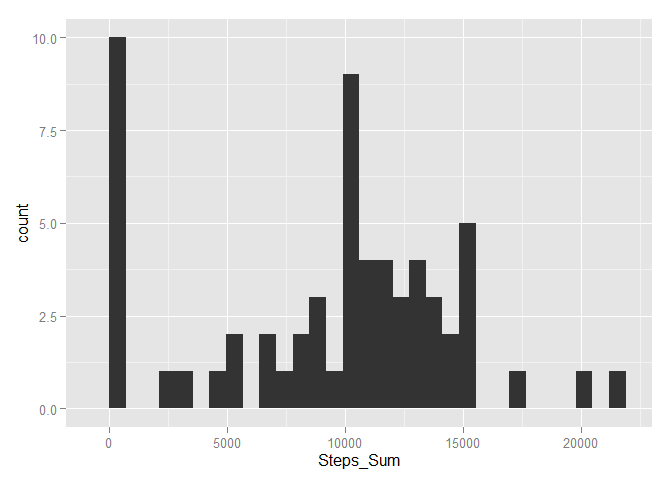
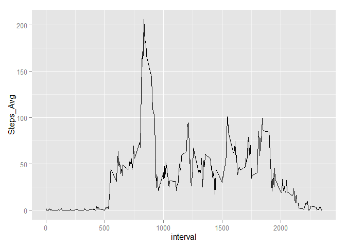
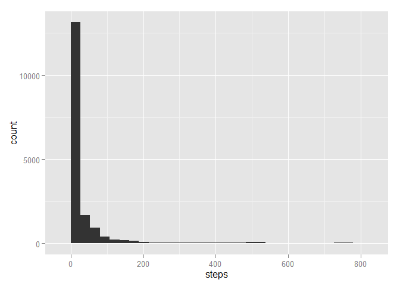
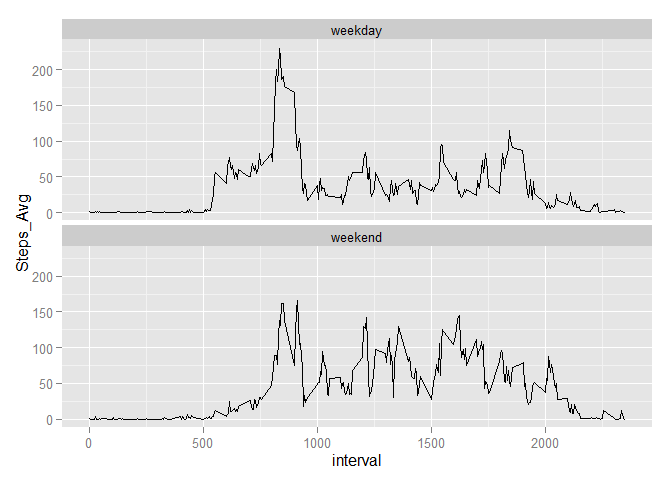

# Assignment 1
Load Libraries


```r
library(knitr)
opts_chunk$set(echo = TRUE)
library(plyr)
library(lubridate)
```

```
## 
## Attaching package: 'lubridate'
```

```
## The following object is masked from 'package:plyr':
## 
##     here
```

```r
library(ggplot2)
```

## Loading and preprocessing the data


```r
url <- "https://github.com/tadhg24/RepData_PeerAssessment1/raw/master/activity.zip"

# If zip file does not exist then download
if(!file.exists("repdata-data-activity.zip"))
{
        # Download data from Coursera Site to Working Directory
        download.file(url, destfile = "repdata-data-activity.zip")      
}

# If txt file does not exist then unzip from downloaded file
if(!file.exists("activity.csv"))
{
        # Unzip Data 'exdata-data-household_power_consumption.zip' into working directory
        unzip("repdata-data-activity.zip")      
}

Activity <- read.csv("activity.csv", header = TRUE)

# Convert Date POSIXct
Activity$date <- ymd(Activity$date)

# Activity Information
summary(Activity)
```

```
##      steps             date               interval     
##  Min.   :  0.00   Min.   :2012-10-01   Min.   :   0.0  
##  1st Qu.:  0.00   1st Qu.:2012-10-16   1st Qu.: 588.8  
##  Median :  0.00   Median :2012-10-31   Median :1177.5  
##  Mean   : 37.38   Mean   :2012-10-31   Mean   :1177.5  
##  3rd Qu.: 12.00   3rd Qu.:2012-11-15   3rd Qu.:1766.2  
##  Max.   :806.00   Max.   :2012-11-30   Max.   :2355.0  
##  NA's   :2304
```


## What is mean total number of steps taken per day?

1 Summarise steps by day

```r
Activity_Dy <- ddply(Activity, ~date, summarise,
                 Steps_Sum = sum(steps, na.rm = T))
Activity_Dy
```

```
##          date Steps_Sum
## 1  2012-10-01         0
## 2  2012-10-02       126
## 3  2012-10-03     11352
## 4  2012-10-04     12116
## 5  2012-10-05     13294
## 6  2012-10-06     15420
## 7  2012-10-07     11015
## 8  2012-10-08         0
## 9  2012-10-09     12811
## 10 2012-10-10      9900
## 11 2012-10-11     10304
## 12 2012-10-12     17382
## 13 2012-10-13     12426
## 14 2012-10-14     15098
## 15 2012-10-15     10139
## 16 2012-10-16     15084
## 17 2012-10-17     13452
## 18 2012-10-18     10056
## 19 2012-10-19     11829
## 20 2012-10-20     10395
## 21 2012-10-21      8821
## 22 2012-10-22     13460
## 23 2012-10-23      8918
## 24 2012-10-24      8355
## 25 2012-10-25      2492
## 26 2012-10-26      6778
## 27 2012-10-27     10119
## 28 2012-10-28     11458
## 29 2012-10-29      5018
## 30 2012-10-30      9819
## 31 2012-10-31     15414
## 32 2012-11-01         0
## 33 2012-11-02     10600
## 34 2012-11-03     10571
## 35 2012-11-04         0
## 36 2012-11-05     10439
## 37 2012-11-06      8334
## 38 2012-11-07     12883
## 39 2012-11-08      3219
## 40 2012-11-09         0
## 41 2012-11-10         0
## 42 2012-11-11     12608
## 43 2012-11-12     10765
## 44 2012-11-13      7336
## 45 2012-11-14         0
## 46 2012-11-15        41
## 47 2012-11-16      5441
## 48 2012-11-17     14339
## 49 2012-11-18     15110
## 50 2012-11-19      8841
## 51 2012-11-20      4472
## 52 2012-11-21     12787
## 53 2012-11-22     20427
## 54 2012-11-23     21194
## 55 2012-11-24     14478
## 56 2012-11-25     11834
## 57 2012-11-26     11162
## 58 2012-11-27     13646
## 59 2012-11-28     10183
## 60 2012-11-29      7047
## 61 2012-11-30         0
```

2 Histogram of Steps/Day

```r
g <- ggplot(Activity_Dy, aes(Steps_Sum))
g + geom_histogram()
```

```
## stat_bin: binwidth defaulted to range/30. Use 'binwidth = x' to adjust this.
```

\

3 Mean & Median of the Steps_Sum / Day

```r
mean(Activity_Dy$Steps_Sum)
```

```
## [1] 9354.23
```

```r
median(Activity_Dy$Steps_Sum)
```

```
## [1] 10395
```


## What is the average daily activity pattern?

Summarise average steps by interval

```r
Activity_Int <- ddply(Activity, ~interval, summarise,
                     Steps_Avg = mean(steps, na.rm = T))
```

1 Average steps by interval

```r
g <- ggplot(Activity_Int, aes(interval, Steps_Avg))
g + geom_line()
```

\

2 5-minute interval with max steps

```r
subset(Activity_Int$interval, Activity_Int$Steps_Avg == max(Activity_Int$Steps_Avg, na.rm = T))
```

```
## [1] 835
```


## Imputing missing values


1 Total number of missing values

```r
MissingValuesSteps <- sum(is.na(Activity$steps))
MissingValuesSteps
```

```
## [1] 2304
```

```r
MissingValuesDate <- sum(is.na(Activity$date))
MissingValuesDate
```

```
## [1] 0
```

```r
MissingValuesInterval <- sum(is.na(Activity$interval))
MissingValuesInterval
```

```
## [1] 0
```

2/3 Replace NA with average steps for that interval

```r
Activity_New <- Activity

for(i in 1:nrow(Activity_New))
{
        int <- Activity_New$interval[i]
        
        if(is.na(Activity_New$steps[i]) == TRUE)
        {
                Activity_New$steps[i] <- Activity_Int$Steps_Avg[Activity_Int$interval == int]
        }
}
```

4 Histogram of total steps / day

```r
g <- ggplot(Activity_New, aes(steps))
g + geom_histogram()
```

```
## stat_bin: binwidth defaulted to range/30. Use 'binwidth = x' to adjust this.
```

\

```r
Activity_New_Dy <- ddply(Activity_New, ~date, summarise,
                     Steps_Sum = sum(steps, na.rm = T))

# Mean
mean(Activity_New_Dy$Steps_Sum)
```

```
## [1] 10766.19
```

```r
# Median
median(Activity_New_Dy$Steps_Sum)
```

```
## [1] 10766.19
```

The Mean & Median are now equal and have increased from before


## Are there differences in activity patterns between weekdays and weekends?

1 Create factor for weekdays & weekend

```r
wkdays <- c("Monday", "Tuesday", "Wednesday", "Thursday", "Friday")

Activity_New$Wkday <- factor((weekdays(Activity_New$date) %in% wkdays),
                             levels = c(TRUE, FALSE),
                             labels = c("weekday", "weekend"))

Activity_New_Int <- ddply(Activity_New, .(interval,Wkday), summarise,
                      Steps_Avg = mean(steps, na.rm = T))
```

2 Panel plot results

```r
g <- ggplot(Activity_New_Int, aes(interval, Steps_Avg))
g + geom_line() + facet_wrap(~ Wkday, nrow = 2, ncol = 1)
```

\
